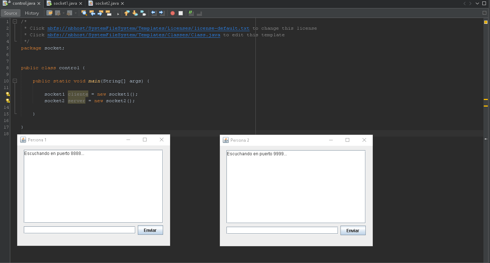
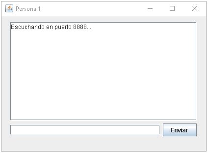
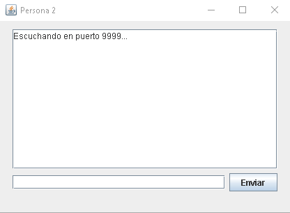
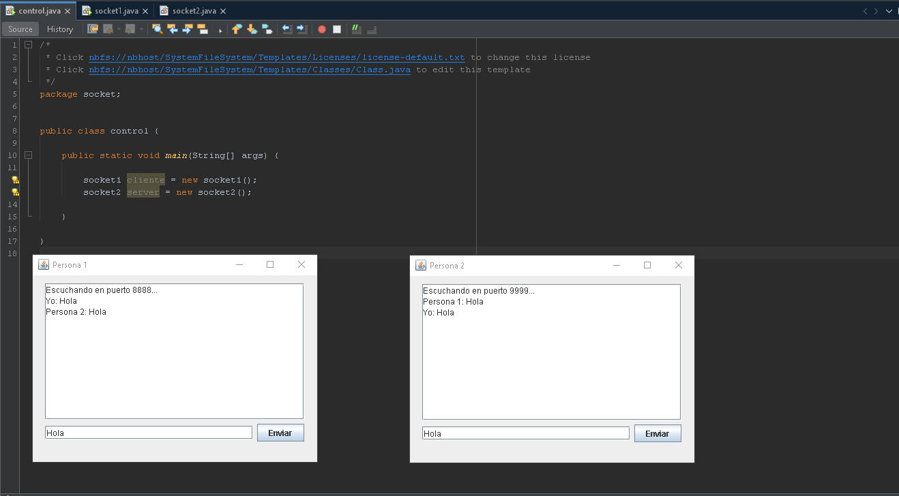
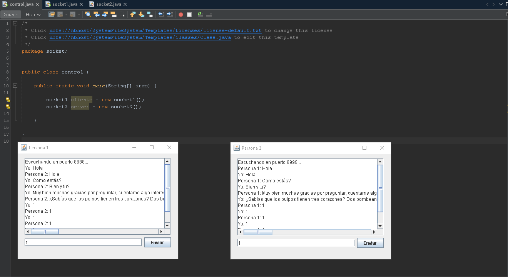

## Parcial 2 Jeicob Murillo

## Al iniciar el programa abre ambas partes del chat

## Persona 1 escucha sobre el puerto 8888 y escribre sobre el puerto 9999

## Persona 2 escucha sobre el puerto 9999 y escribre sobre el puerto 8888

## Los cuadros son exactamente iguales debido a que el codigo de interfaz es igual.

## Se puede mantener una conversación, para el emisor de los mensajes observa como mensaje enviado por "Yo" y recibido de la otra persona.

## Se puede continuar la conversacion como sea necesario, se usan ScrollPanel para que pueda hacerse la conversacion tan larga como sea necesaria

